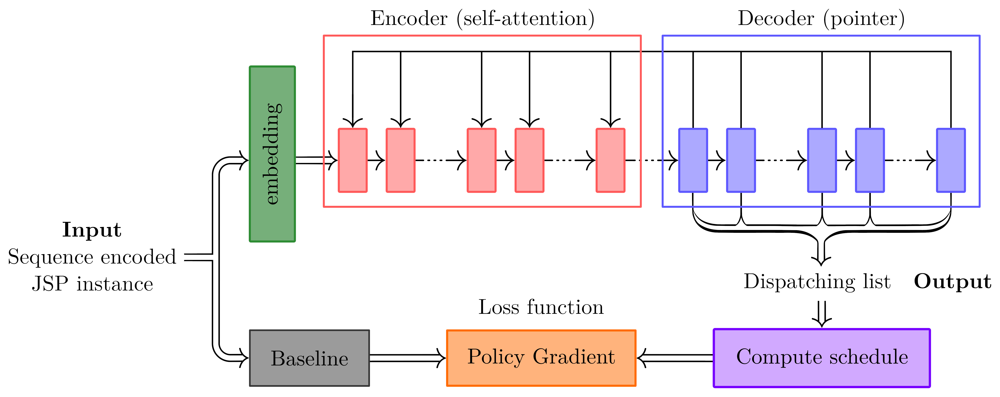

# Job Shop Scheduling via Deep Reinforcement Learning: a Sequence to Sequence approach

Official code of *[Job Shop Scheduling via Deep Reinforcement Learning: a Sequence to Sequence approach](https://link.springer.com/chapter/10.1007/978-3-031-44505-7_32)*, published at the [17th International Conference on Learning and Intelligent Optimization Conference](https://lion17.org/) (LION17).



## Video presentation

⬇️ Click to watch on YouTube ⬇️

[</img>](https://www.youtube.com/watch?v=cia7sx6xNOs)

## Abstract

Job scheduling is a well-known Combinatorial Optimization problem with endless applications. Well planned schedules bring many benefits in the context of automated systems: among others, they limit production costs and waste. Nevertheless, the NP-hardness of this problem makes it essential to use heuristics whose design is difficult, requires specialized knowledge and often produces methods tailored to the specific task. This paper presents an original end-to-end Deep Reinforcement Learning approach to scheduling that automatically learns dispatching rules. Our technique is inspired by natural language encoder-decoder models for sequence processing and has never been used, to the best of our knowledge, for scheduling purposes. We applied and tested our method in particular to some benchmark instances of Job Shop Problem, but this technique is general enough to be potentially used to tackle other different optimal job scheduling tasks with minimal intervention. Results demonstrate that we outperform many classical approaches exploiting priority dispatching rules and show competitive results on state-of-the-art Deep Reinforcement Learning ones. 

## Citation

##### Springer LNCS

```
@inproceedings{bonetta2023job,
   title={Job Shop Scheduling via Deep Reinforcement Learning: A Sequence to Sequence Approach},
   author={Bonetta, Giovanni and Zago, Davide and Cancelliere, Rossella and Grosso, Andrea},
   booktitle={International Conference on Learning and Intelligent Optimization},
   pages={475--490},
   year={2023},
   organization={Springer}
}
```

##### ArXiV (*incomplete version*)

``` 
@article{bonetta2023job,
    title={Job Shop Scheduling via Deep Reinforcement Learning: a Sequence to Sequence approach},
    author={Bonetta, Giovanni and Zago, Davide and Cancelliere, Rossella and Grosso, Andrea},
    journal={International Conference on Learning and Intelligent Optimization (LION17)},
    year={2023}
}
```
